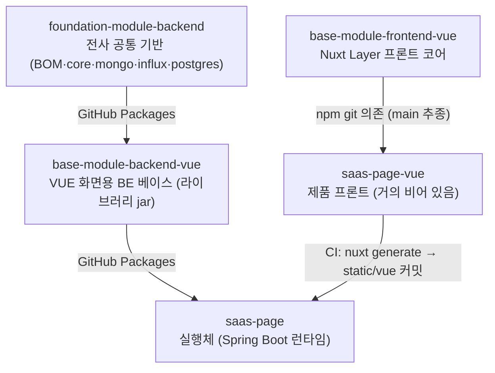

자사 B2B SaaS 를 웹스퀘어 종속 환경에서 VUE 로 옮기는 차세대 마이그레이션의 **초안 재료**로, 이미 VUE 로 돌고 있는 사내 레포 5종이 각각 무슨 역할인지만 가볍게 정리한다. 목적은 "코어를 상속받아 그 위에 구현을 얹기" 위한 지형 파악이라 세부 구현은 파고들지 않았다. 2026-09-09 기준 각 레포 `main` 스냅샷이다.

## 한눈에 — 백엔드/프론트가 대칭인 3단 상속



핵심은 **`saas-page` 가 최종 실행체이고, `saas-page-vue` 는 그 안에 들어갈 정적 화면을 만드는 별도 레포**라는 점이다. 프론트는 자기 서버로 뜨지 않고, 빌드 산출물이 백엔드 레포의 `src/main/resources/static/vue` 로 커밋된다.

## 1. foundation-module-backend — 전사 공통 기반

제품과 무관한 바닥. 멀티모듈 Gradle 프로젝트이고 `core / mongo / influx / postgres` 4개 서브모듈로 나뉜다.

- Java 21, Spring Boot 3.5.16, group `com.cloudlab.wt`, version 1.9.23.
- 루트 `build.gradle` 이 **BOM**(Bill of Materials, 라이브러리 버전을 한곳에 모아 고정하는 명세) 역할을 한다. MyBatis·MapStruct·JWT(jjwt)·Jasypt·AWS SDK·Tika·InfluxDB client·Firebase FCM·MQTT(Paho)·springdoc 등 팀이 쓰는 버전이 전부 여기 박혀 있다.
- `core` 안에는 `security`(JWT 인증), `exception`, `aop`, `util` 같은 인프라 계층과, 비즈니스 모듈(`bm`)로 **auth · file · message · streaming** 이 들어 있다. 즉 로그인·파일·메시지·스트리밍은 이미 공통으로 제공된다.
- `mongo` / `influx` / `postgres` 는 해당 DB 를 쓸 때만 얹는 어댑터다.
- 배포는 **GitHub Packages**(GitHub 이 제공하는 사설 패키지 저장소). `main` 병합 시 GitHub Actions 가 패키징해 의존 프로젝트에 자동 반영되고, 패치 버전이 자동으로 올라간다.
- 빌드/런타임에 `GITHUB_ACTOR`, `GITHUB_TOKEN`, `CL_JASYPT_PASSWORD` 환경변수가 필요하다.

## 2. base-module-backend-vue — "VUE 화면용" 백엔드 베이스

단일 프로젝트이고 `bootJar` 를 끄고 `jar` 만 켠다. 즉 **실행 앱이 아니라 라이브러리**다. 버전 1.0.13.

- foundation BOM 1.9.23 을 import 하고 `foundation-module-backend-core` + `-mongo` 만 `api` 로 노출한다. (influx/postgres 미사용 → 이 라인은 **Oracle + Mongo** 조합)
- 패키지 `com.cloudlab.wt.base.vue` 아래 비즈니스 모듈:
  - **auth** — 로그인 / 토큰 컨트롤러
  - **account** — 회사·사용자·프로젝트·모니터그룹·모니터프로젝트·테마색상 컨트롤러 6종
  - **file** — 첨부파일 / 비정형파일
  - **sample** — 공지·프로젝트멤버 예제
- 각 모듈은 `controller / converter(MapStruct) / mapper(MyBatis) / model / service` 5단 구조로 통일돼 있다. 신규 기능을 추가할 때 그대로 따라 쓰면 되는 규약이다.
- 리소스에 MyBatis XML 이 `bvue/mapper/oracle/...` 경로로 들어 있어 **Oracle 전제**임이 드러난다.
- **Spring 자동설정**(`META-INF/spring/...AutoConfiguration.imports`)으로 3개를 등록한다: `BvueEnvVariablesConfig`, `BvueSecurityConfig`, `BvueThymeleafResolverConfig`. 의존만 걸면 이 설정이 자동으로 붙는다는 뜻이다.
- ⚠️ jar 패키징에서 `static/vue/**` 와 `application*.properties`, `logback-spring.xml` 을 **제외**한다. 레포 안의 `static/vue` 는 개발용 샘플일 뿐이고, 실제 서비스 정적 파일은 소비 앱 쪽에 들어간다.

## 3. saas-page — 실행체. 놀랄 만큼 얇다

Spring Boot 앱인데 자바 파일이 사실상 3개다.

| 파일 | 역할 |
|---|---|
| `SaasPageApplication` | `@SpringBootApplication` + main. 그게 전부 |
| `config/SecurityConfig` | REST/VIEW 시큐리티 체인 2개 정의 |
| `component/EnvVariables` | `@ConfigurationProperties(prefix="self")` 로 앱 고유 설정 바인딩 |

여기서 눈여겨볼 대목이 **시큐리티 오버라이드 방식**이다. `saas-page` 가 정의하는 빈 이름 `securityFilterRestChain` / `securityFilterViewChain` 은 `BvueSecurityConfig` 가 자동설정으로 제공하는 빈과 **이름이 같다**. `BvueSecurityConfig` 에는 `@ConditionalOnMissingBean` 이 없으므로 이름 충돌만으로는 부팅이 깨지는데, `application.yml` 에 다음이 켜져 있어 앱 정의가 자동설정 정의를 덮는다.

```yaml
spring:
  main:
    allow-bean-definition-overriding: true   # 이게 있어야 같은 이름 재정의가 성립한다
```

즉 "같은 이름 빈으로 코어 설정을 갈아끼우기"는 이 플래그가 **전제 조건**이다. 우리 쪽 구현에서도 같은 수법을 쓰려면 이 설정을 함께 가져가야 한다.

나머지는 프로파일별 프로퍼티(`local/dev/prod`), 로그백 설정, Thymeleaf `index.html`, 그리고 프론트 빌드 산출물이 들어올 `src/main/resources/static/vue` 자리다. `application.yml` 은 Spring 기본 `DataSource` / `Mongo` / `InfluxDb` 자동설정을 `spring.autoconfigure.exclude` 로 빼고 있다 — 그 자리를 foundation 쪽 설정이 대신한다는 뜻이다.

> ⚠️ `main` 기준으로 `saas-page` 는 `base-module-backend-vue:1.0.5` / foundation BOM `1.9.4` 를 물고 있어 각 베이스의 `main`(1.0.13 / 1.9.23)보다 뒤처져 있다. 배포 워크플로 주석에 "버전 동기화 봇이 `dev` 브랜치에 커밋한다"는 언급이 있으므로 `dev` 는 다를 수 있다 — **확인 필요**.

## 4. base-module-frontend-vue — Nuxt Layer 형태의 프론트 코어

여기가 우리가 상속받을 본체다. **Nuxt Layer**(Nuxt 가 제공하는 프로젝트 상속 기능. 다른 Nuxt 프로젝트를 통째로 베이스로 깔고 필요한 부분만 덮어쓴다)로 배포되도록 만들어져 있다.

- Nuxt 4.5 / Vue 3.5, `ssr: false` → **SPA**. `package.json` 의 `main` 이 `nuxt.config.ts` 를 가리키는 게 레이어 패키지의 표식이다.
- alias `#bvue` → `./app`. 소비 앱은 `#bvue/...` 로 코어를 참조한다.
- 스택: Vuetify 3.13, Pinia(+ persistedstate), ag-grid 35, chart.js 4(+ vue-chartjs, datalabels), gridstack, hls.js, dayjs, chroma-js, lodash-es.
- `app/` 은 계층이 뚜렷하게 갈려 있다:

| 계층 | 내용 |
|---|---|
| `domain/models` | bvueUser, bvueCompany, bvuePage(s), bvueProject(s), bvueMonitorGroup(s), bvueToken, bvueThemeColor |
| `domain/repositories` | 인터페이스만 (`*.repository.interface.ts`) |
| `domain/services` | 도메인 서비스 |
| `infra/repositories`, `infra/mappers` | 실제 구현 + DTO↔모델 변환 |
| `stores` | Pinia 스토어 13종 |
| `composables` | `useBvue*Logic` / `*Util` 25종 (api·인증·파일·테마·그리드·색상 등) |
| `components/bvue` | chart · dialog · layout · message · banner · sample, PdfViewer/ImageViewer 등 |
| `layouts` | default, bvue-blank, bvue-page, bvue-pages |
| `middleware` | `001.bvue.auth.global.ts` — 전역 인증 가드 |
| `plugins` | api / vuetify / ag-grid / dayjs / 에러핸들러 / 페이지 생명주기 필터 |
| `pages/bvue` | login, login-bridge, sample 화면 다수 |

- 런타임 설정(`runtimeConfig.public`)은 `stage / project / apiBaseUrl / coreApiKey / userNo` 등이고, 운영에서는 빈 값으로 두고 로컬만 `.env` 로 채운다.
- `app.baseURL` 은 `CONTEXT_PATH` 환경변수로 결정되고, `nuxt generate` 산출물 경로도 CI 여부에 따라 갈린다.
- `workspace-template/` + `npm run workspace:setup` 으로 상위 폴더에 npm workspace 템플릿을 깔아 로컬 개발한다.

## 5. saas-page-vue — 제품 프론트인데 거의 비어 있다

이 레포가 구조를 가장 잘 보여준다. **소스 파일이 4개뿐이다.**

- 유일한 dependency 가 `"base-module-frontend-vue": "github:Cloudlab-WT/base-module-frontend-vue#main"` — 버전 고정이 아니라 **`main` 을 추종하는 git 의존성**이다.
- `nuxt.config.ts` 에 `extends: ['base-module-frontend-vue']` 한 줄로 코어를 통째로 상속한다.
- `app/` 내용물:
  - `app.config.ts` — 사실상 빈 껍데기
  - `constants/pages/samples.ts`, `constants/pages/production.ts` (**`PRODUCTION_PAGES` 는 아직 빈 배열**)
  - `plugins/app-config.global.ts` — 위 둘을 합쳐 `appConfig.pages` 에 주입

그리고 상속받은 코어를 갈아끼우는 방법이 여기 실증돼 있다:

```ts
// nuxt.config.ts — 코어가 참조하는 경로를 소비 앱 파일로 치환
vite: {
  resolve: {
    alias: [
      { find: '#bvue/constants/pages/samples',    replacement: resolve('app/constants/pages/samples') },
      { find: '#bvue/constants/pages/production', replacement: resolve('app/constants/pages/production') },
    ],
  },
}
```

즉 **레이어 상속(전체) + Vite alias 치환(부분 교체)** 두 겹으로 확장한다.

## 6. 빌드·배포를 잇는 기계장치

`saas-page-vue` 의 배포 워크플로가 이 구조의 심장이다. 트리거가 셋이다.

1. `saas-page-vue` 의 `dev` → `main` PR 병합
2. **`repository_dispatch: base-frontend-updated`** — 코어(`base-module-frontend-vue`)가 `main` 에 병합되면 그쪽 워크플로가 이 이벤트를 쏜다. 소비 앱 코드가 하나도 안 바뀌어도 코어가 바뀌면 다시 빌드해야 하기 때문. (`workflow_dispatch` REST API 는 `actions:write` 권한이 필요한데 사내 GitHub App 에는 `contents:write` 밖에 없어 `repository_dispatch` 를 택했다는 주석이 달려 있다)
3. 수동 실행

흐름은 이렇다.

```
checkout(persist-credentials:false)
  → GitHub App 토큰 발급 → git insteadOf 로 private 의존성 인증
  → npm install            (lockfile 을 일부러 두지 않음 = 코어 main 최신 강제)
  → 설치된 코어 커밋 SHA 추출·기록
  → npm run generate       (CONTEXT_PATH=/static/vue, CI=true → .output/public)
  → saas-page 의 dev 브랜치 checkout
  → src/main/resources/static/vue 통째 교체 + .deploy-manifest.json 기록
  → "[skip ci]" 커밋 → push (충돌 시 rebase 3회 재시도)
```

`.deploy-manifest.json` 에 소스 커밋·코어 커밋·트리거·실행 ID·시각을 남겨 두어, 문제가 생기면 어느 프론트 커밋에서 나온 산출물인지 역추적할 수 있게 해 두었다.

## 7. 우리가 얹을 때의 확장 지점

**프론트**

- 새 레포에서 `extends: ['base-module-frontend-vue']` 로 코어 전부 상속.
- 화면은 자기 `app/pages`, `app/components` 에 추가. 코어 파일을 바꿔야 하면 Vite alias 로 `#bvue/...` 치환.
- 메뉴/페이지 목록은 `constants/pages/production.ts` 를 채우면 플러그인이 `appConfig.pages` 로 주입한다.
- 코어 자체 수정이 필요하면 `base-module-frontend-vue` 에 PR → `main` 병합 → dispatch 로 소비 앱이 자동 재빌드된다.

**백엔드**

- 새 Spring Boot 앱에서 `base-module-backend-vue` 를 의존하면 자동설정 3종과 auth/account/file API 가 따라온다.
- 바꾸고 싶은 설정은 **같은 이름의 빈**을 자기 앱에 정의해 덮는다(`saas-page` 가 시큐리티에 쓴 방식). 단 `spring.main.allow-bean-definition-overriding: true` 가 켜져 있어야 성립한다.
- 도메인 기능은 `controller / converter / mapper / model / service` 5단 규약으로 추가하고, MyBatis XML 은 `resources/**/mapper/oracle/...` 경로 규약을 따른다.
- 두 저장소 모두 GitHub Packages 인증(`GITHUB_ACTOR` / `GITHUB_TOKEN`)이 필요하다.

## 8. 남은 확인거리

- 조직에 **`saas-dashboard` / `saas-dashboard-vue`** 쌍이 동일 패턴으로 존재한다. 베이스 모듈이 다중 소비자를 전제로 설계됐다는 증거이고, 신규 제품도 같은 쌍으로 만들면 된다는 뜻이다.
- `saas-page` 의 의존 버전은 `main` 스냅샷 기준이라 `dev` 와 다를 수 있다 — 확인 필요.
- **웹스퀘어 화면을 어떤 규칙으로 VUE 화면에 대응시킬지**는 이 5개 레포 어디에도 없다. 별도 과제로 남는다.
- `saas-page-vue` / `base-module-frontend-vue` 모두 README 가 비어 있어 온보딩 문서가 없다.
