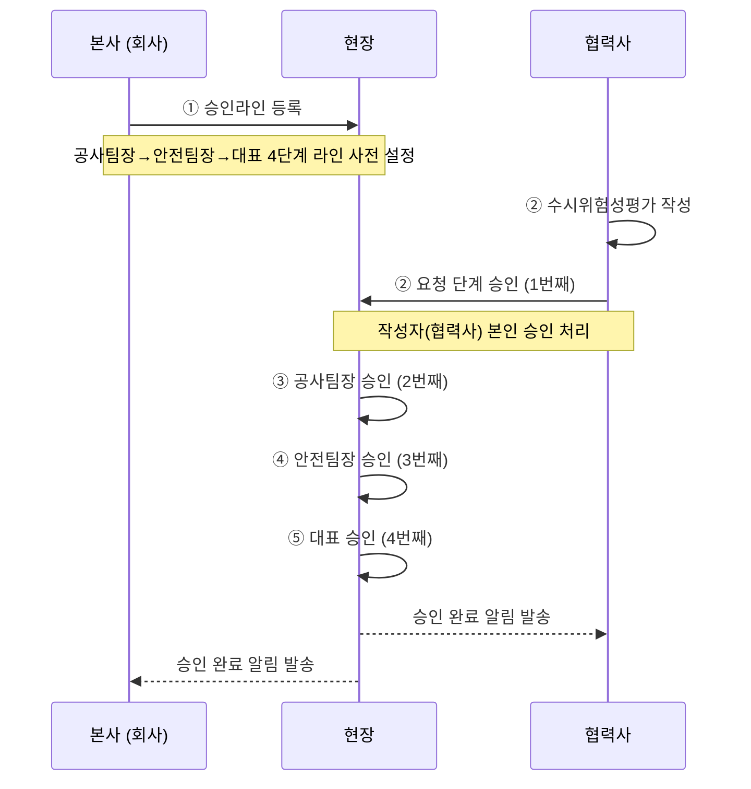
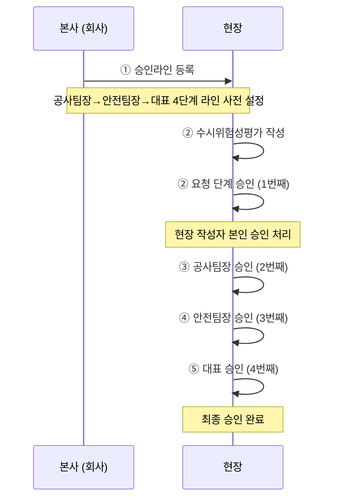

# 수시위험성평가 승인라인 시퀀스 다이어그램

> ⚠️ **설계 예시**: 아래 4단계는 **기본값/예시**이며, SCNT 도입 후 실제 승인라인은 **회사별로 커스텀**됩니다(현장 승인라인 관리 화면). → 계획: [../SCNT_표준승인_도입계획.md](./SCNT_표준승인_도입계획.md)

## 승인 단계 구성

| 순서 | 단계 | 승인자구분 |
|------|------|----------|
| 1번째 | 요청 | 작성자 |
| 2번째 | 공사팀장승인 | 공사팀장 |
| 3번째 | 안전팀장승인 | 안전팀장 |
| 4번째 | 대표승인 | 대표 |

---

## Case 1. 협력사가 있는 경우 (원하도급, 일반적)

> 참여자: 본사(회사) · 현장 · 협력사

---

## Case 2. 협력사가 없는 경우 (원도급, 예외사항 - 협력사가 없을 때)

> 참여자: 본사(회사) · 현장

# 수시위험성평가 승인라인 플로우 차트

> **반려** → (SCNT 도입 후) **같은 평가서를 보존(반려 표시 + 버전업)한 뒤 요청자가 수정해 재요청.** 새 회차 신규 생성 아님 — SCNT 버전 모델(계획문서 B1).  
> **승인취소** → 자신의 승인을 철회하고 바로 이전 단계로 복귀

```mermaid
flowchart TD
    S(협력사/현장) --> CREATE

    CREATE[위험성평가서 생성] --> REQ

    REQ{요청자 결재}
    REQ -- 승인 --> CM

    CM{공사팀장 결재}
    CM -- 승인 --> SM
    CM -- 승인취소 --> REQ
    CM -- 반려 --> REQ

    SM{현장소장 결재}
    SM -- 승인 --> CEO
    SM -- 승인취소 --> CM
    SM -- 반려 --> REQ

    CEO{대표 결재}
    CEO -- 승인 --> DONE
    CEO -- 승인취소 --> SM
    CEO -- 반려 --> REQ

    DONE[최종 승인 완료]
    DONE --> END(푸시 알림 발송)

    style S fill:#000, stroke:#000
    style END fill:#fff, stroke:#000, stroke-width:4px
```

---
